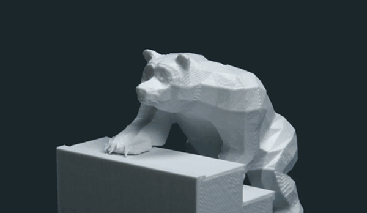

  
  <h3 align="center"> <i> Step by step ... </i> </h2>

  <h1 align="center"> :wave: Hey there!   My name is Victor Combat </h1>

  

    
    
    
    
  

## :page_with_curl: About Me

I'm a French student in my last year of master's degree in computer science, specialized in computer graphics at the [Claude Bernard University Lyon 1](https://www.univ-lyon1.fr/). I'm interested in many things : mobile development, computer graphics/vision, blockchains, geospatial, games ...

## :bulb: Featured Projects

  
  
  

## :books: My Skills
  
 | **💻 Programming Languages** | **🧰 Frameworks / Libraries** | **🛠️ Utilities / Tools** |
 | :---: | :---: | :---: |
 | C++ | Qt | Git |
 | C# | Unity | Maven |
 | Javascript | OpenCV | Design Patterns |
 | Java | OpenGL | MVC / MVVM |
 | Dart | Flutter | |
 | Python 3 | | |

